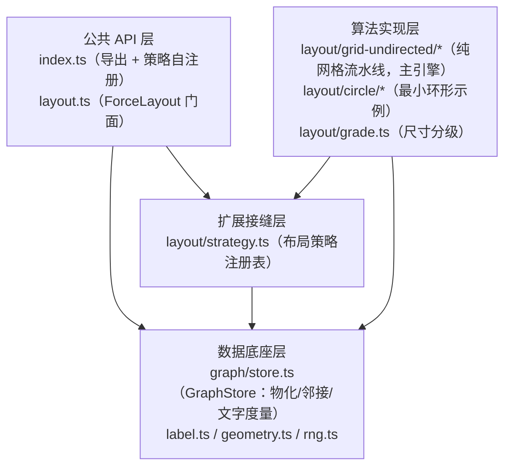

# fishgraph 整体架构设计

> 本文档从代码反向梳理，描述 fishgraph 的模块职责、依赖关系与核心数据流。
> 各阶段的算法细节见 [layout-grid-undirected.md](./layout-grid-undirected.md)，
> 设计原则见 [布局核心原则.md](./布局核心原则.md)。

## 1. 背景与定位

fishgraph 是一个**图布局算法库**：输入图规格（`GraphSpec`：节点 + 连线 + 可选
subgraph 分组），输出每个节点的二维坐标（含物化 AABB 尺寸与正交走线拐点）。
典型消费方是渲染层（demo 用 canvas，测试用 SVG），布局本身不涉及任何绘制。

2026-09-26 起引擎收敛：**grid-undirected 纯网格流水线是唯一主引擎**
（力导向无向/有向、分组无向已删除；circle 仅作为策略接缝的最小示例保留）。
布局在构造期一次算定——无力学、无迭代、确定性逐位重放。

## 2. 总体结构

三个层次，依赖方向自上而下、单向无环：



## 3. 模块职责

| 模块 | 职责 |
|---|---|
| `src/layout.ts` | ForceLayout 门面：DEFAULTS 合并、策略创建/热切换、API 透传 |
| `src/layout/strategy.ts` | 布局策略接缝：`LayoutStrategy` 接口 + `registerStrategy` 注册表 |
| `src/layout/grid-undirected/strategy.ts` | 主引擎流水线调度：放置 → 膨胀 → 压实 → 走线 → 物理化写回 |
| `src/layout/grid-undirected/coarse.ts` | 阶段 1 质点波纹放置：BFS 生长 + 环形扩搜评分 + 死锁插行列；无向/有向放置美学钩子 |
| `src/layout/grid-undirected/levels.ts` | 有向模式：解环（DFS 反馈边）+ 最长路径分层 |
| `src/layout/grid-undirected/directed-placement.ts` | 有向层级引导放置（锚点钉层级行、层级偏离罚、方向罚、拥堵插列） |
| `src/layout/grid-undirected/expansion.ts` | 阶段 2/3 膨胀网格：中心对称 AABB 物化 + 通道约束压实 |
| `src/layout/grid-undirected/grid-route.ts` | A\* 正交走线（拐点惩罚，曼哈顿启发） |
| `src/layout/grid-undirected/grid-context.ts` | 网格空间上下文：占用表、插行列腾位、走线封装 |
| `src/layout/grid-undirected/space-types.ts` | Point / Bounds / Box（半开区间口径） |
| `src/layout/grade.ts` | 尺寸分级：px 盒 → 整数格占用（宽/高独立聚类定基准格） |
| `src/layout/circle/strategy.ts` | circle 策略：连通分量摆正多边形环（无力学，接缝示例） |
| `src/graph/store.ts` | GraphStore：GraphSpec 物化、邻接表、文字度量、增删改查 |
| `src/edge/types.ts` | 连线风格策略接缝：Port / Path / Corner / Crossing 四接口 + PathSegment 段模型 |
| `src/edge/ports.ts` | 端点对接策略：固定四点（FixedPort）/ 同侧均匀分布（DistributedPort） |
| `src/edge/paths.ts` | 路径风格策略：正交折线 / 直线 / 贝塞尔 / 斜折线分散 |
| `src/edge/corners.ts` | 转弯风格策略：直角（尖点）/ 圆角（相切圆弧替代拐点） |
| `src/edge/crossings.ts` | 交叉风格策略：平交 / 立交（交点跳线弧） |
| `src/edge/segments.ts` | 路径段几何工具：段终点、弧长、弧上取点、路径长度 |
| `src/edge/renderer.ts` | EdgeStyleRenderer 装配器：布局输出 → 逐边几何段（含标签锚点与末端箭头） |

## 4. 核心数据流

```
GraphSpec ──▶ GraphStore（节点/容器/边物化 + 邻接表 + 文字盒）
        ──▶ applyNodeLabelSizes（文字物化进格盒） + refreshGrades（尺寸分级 → cellScale）
        ──▶ 阶段1 coarseGridPlacement（波纹放置，1×1 质点格坐标 posOf）
        ──▶ 阶段2 ExpansionGrid（中心对称膨胀为 gw×gh 格 AABB）
        ──▶ 阶段3 compact（通道压实：相邻行/列空隙 = channelMargin）
        ──▶ 物理化（AABB 中心 → elements.x/y，格宽高 × cellScale → elements.w/h）
        ──▶ 阶段4 GridSpaceContext.routeEdge（A* 正交走线 → InternalEdge.waypoints）
```

## 5. 架构决策与约束

1. **策略模式接缝**：算法只通过 GraphStore 读写数据；`registerStrategy` 注册、
   `createStrategy` 按名创建，`ForceLayout.setStrategy` 运行时热切换。
2. **格单位主权**：布局与存储只认整数格（`gw/gh`、格坐标），px 仅是中间量
   （格 × cellScale），渲染映射可逆。
3. **简单规则无例外**：布局由少数局部规则决定，不做结构识别与规则豁免；
   形状契约必须是规则的涌现结果（见布局核心原则）。
4. **确定性**：放置顺序、评分、平局裁决全固定规则；同输入逐位重放。
5. **无重叠由构造保证**：质点放置的占用检查 + 膨胀的插行列让位 + 压实的
   通道下限，三段构造性排除重叠，不依赖事后修正。
6. **连线风格与布局解耦**：连线"长什么样"（端点对接 / 路径 / 转弯 / 交叉）
   由 `src/edge/` 四个正交策略接口决定，均为纯几何计算、只消费布局输出
   （nodeViews / edgeViews.waypoints），不反哺布局；渲染端只需翻译
   line/arc/bezier 段序列（见 `EdgeStyleRenderer`）。

## 6. 连线风格管线

每条边依序经过四个策略，前者的输出是后者的输入：

```
edgeViews.waypoints ─┐
nodeViews/subgraphs ─┴─▶ PortStrategy（端口 + 外法向）
                        ──▶ PathStrategy（EdgePath：line 段序列）
                        ──▶ CornerStrategy（拐点 → 尖点或圆弧）
                        ──▶ CrossingStrategy（按绘制序对先画边跳线）
                        ──▶ EdgeGeometry（段序列 + 标签锚点 + 箭头切向）
```

- 端口分组：同侧边按「对端方向主导轴」分组、沿侧边自然序给 slot；
  平行边（同端点对）按声明序给 bundle slot —— 分散类策略据此横移避让。
- 走线骨架裁剪：A\* waypoints 首尾段位于元素 AABB 内部（从中心格出发），
  路径策略按两端 AABB 裁掉内部段，端口 breakout 后不再反向穿回节点；
  与节点重叠的连接段由渲染端「节点层后画且有填充」遮盖。

## 7. 测试

- `tests/grid-undirected.test.ts` —— 流水线不变量（成行成列、无重叠、
  通道宽度、正交走线、确定性、rebuild 重放）+ 膨胀对称性单元测试
- `tests/shape-contract.test.ts` —— 用户口径形状契约 12 场景硬性验收
- `tests/grade.test.ts` —— 尺寸分级
- `tests/strategy.test.ts` —— 策略接缝（注册/热切换/图变更）
- `tests/edge-style.test.ts` —— 连线风格策略（端口/路径/转弯/交叉 + 装配器端到端）
- `tests/architecture.test.ts` —— 架构边界（src 不含图实例数据）
