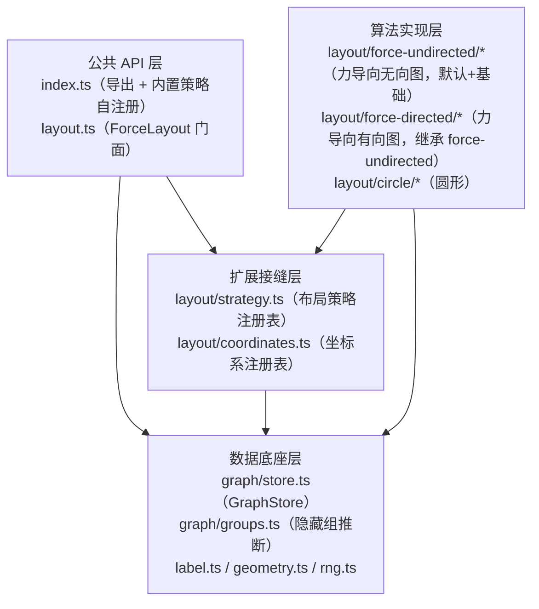
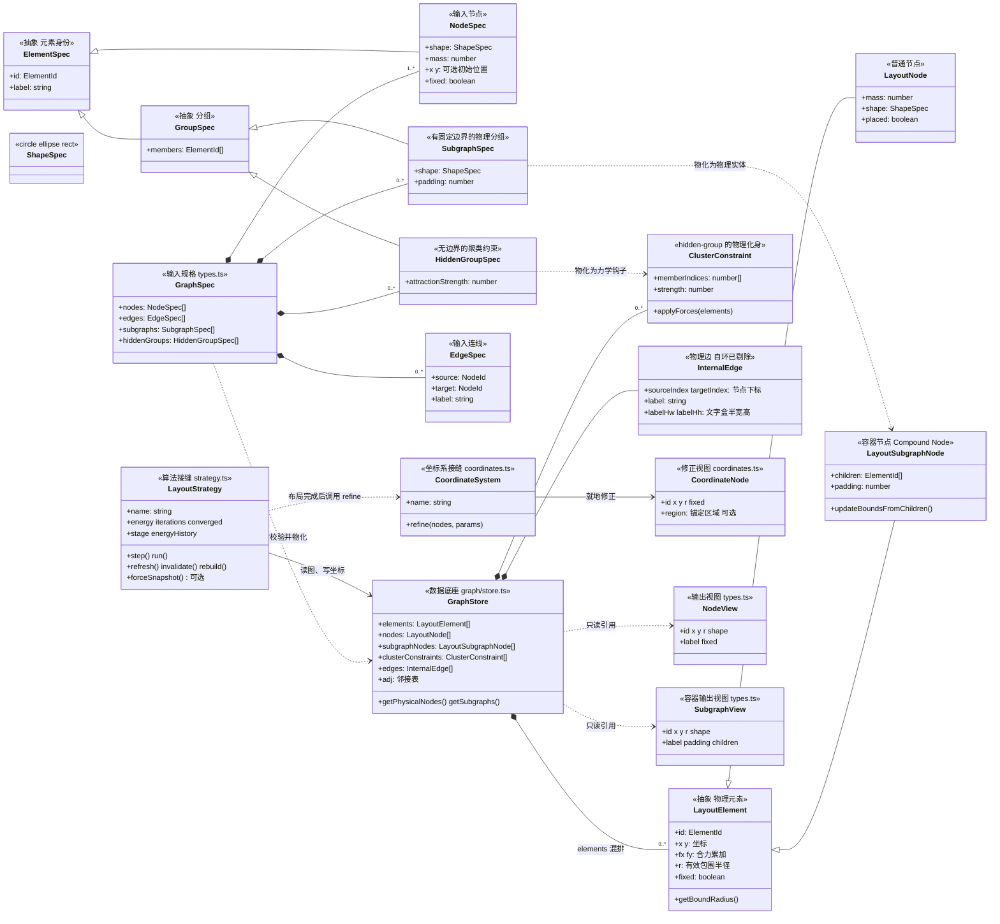

# fishgraph 整体架构设计

> 本文档从代码反向梳理，描述 fishgraph 的整体架构：模块职责、依赖关系、核心数据流、
> 架构决策与约束。各布局算法的内部设计不在本文展开，见文末「相关文档」。
>
> 依据：`src/`（约 3.9k 行 TypeScript）、`tests/`、`README.md`。零运行时依赖。

## 1. 背景与定位

fishgraph 是一个**图布局算法库**：输入图规格（`GraphSpec`：节点 + 连线 + 可选分组），输出每个节点的二维坐标。典型消费方是渲染层（demo 用 canvas，测试用 SVG），布局本身不涉及任何绘制。

两个根本定位决定了架构形态：

1. **算法会持续增加**。布局算法是变化最频繁的部分（目前已有力导向无向图、力导向有向图、圆形三种，坐标修正策略也有 free、grid 两种），因此「算法可替换」必须是第一接缝。
2. **物理模型要求严格自洽**。所有力都从同一个能量泛函求梯度得到（力 = −∇E），求解器靠「能量单调下降」保证收敛。这不是单个算法的内部细节，而是横切所有力学实现的**架构级约束**——任何一处力与能量不一致，线搜索就会失效。

## 2. 总体结构

四个层次，依赖方向自上而下、单向无环：



```text
src/
├── index.ts                  # 公共导出；副作用 import 内置策略/坐标系（自注册）
├── layout.ts                 # ForceLayout 门面：装配 store + 策略，DEFAULTS 合并，API 转接
├── types.ts                  # 公共类型：GraphSpec/NodeSpec/LayoutOptions/RunResult/...
├── graph/
│   ├── store.ts              # GraphStore：图数据持有、校验、邻接、角色派生、标签度量
│   └── groups.ts             # detectHiddenGroups：隐藏组拓扑推断（独立纯函数）
├── layout/
│   ├── strategy.ts           # LayoutStrategy 接口 + 注册表（接缝）
│   ├── coordinates.ts        # CoordinateSystem 接口 + 注册表 + free/grid 内置（接缝）
│   ├── force-directed/       # 力导向有向图策略（继承 ForceUndirectedStrategy，派生接缝注入有向语义），见 doc/layout-force-directed.md
│   │   ├── levels.ts         #   解环（三色 DFS 识别反馈边）+ 最长路径层级
│   │   ├── directedCoarse.ts #   有向放置美学：层级行锚点/层级罚/方向罚/插列 + 层内 barycenter 排序
│   │   └── strategy.ts       #   流动势能（extraForces 缝）、TB/LR 方向参数化
│   ├── force-undirected/     # 力导向无向图策略（**默认算法、基础算法**，共享力学引擎所在地），见 doc/layout-force-undirected.md
│   │   ├── coarse.ts         #   质点网格粗布局 + 膨胀压实（CoarseHeuristics 放置美学钩子；无重叠由构造保证）
│   │   ├── strategy.ts       #   流水线编排：粗布局初值 + 短弛豫微调（protected 派生接缝）
│   │   ├── forces.ts         #   力场计算（物理核心）：精确 O(n²) 与 Barnes-Hut 两路
│   │   ├── solver.ts         #   RelaxationSolver：信任域 + 回溯线搜索
│   │   ├── hops.ts           #   跳数斥力衰减矩阵（拓扑导出，3000 节点上限）
│   │   ├── crossings.ts      #   边交叉计数（扫描线 + 预算回退）
│   │   ├── quadtree.ts       #   Barnes-Hut 四叉树（双树遍历，保保守性）
│   │   └── spatialgrid.ts    #   均匀空间网格（避让候选对加速）
│   └── circle/
│       └── strategy.ts       # 圆形策略（接缝验证用的最小算法），见 doc/layout-circle.md
├── geometry.ts               # 向量、点到线段投影、形状 SDF、包围半径
├── label.ts                  # 文字包围盒估算与最小面积回绕（纯数据，无力学）
└── rng.ts                    # mulberry32 可播种 PRNG、确定性抖动方向
```

## 3. 模块职责

### 3.1 公共 API 层

- **`ForceLayout`（`src/layout.ts`）**：唯一的门面类，只做**装配与委派**——
  合并默认参数、创建 `GraphStore`、按名创建策略、把公共 API 转接给两者。
  自身不含任何布局逻辑。同时是**生命周期翻译器**：把「参数更新」「拖拽/固定」
  「增删节点/边」三类外部变化分别翻译为策略的 `refresh()` / `invalidate()` /
  `rebuild()` 回调（见 §5.3）。
- **`src/index.ts`**：公共 API 的唯一出口。通过副作用 import 触发内置策略与
  坐标系的自注册——消费方 `import { ForceLayout } from 'fishgraph'` 之后，
  `'force-undirected'`、`'force-directed'`、`'circle'`、`'free'`、`'grid'` 即全部可用。

### 3.2 数据底座层

- **`GraphStore`（`src/graph/store.ts`）**：「图数据的持有与变更」，与布局算法
  完全分离的**稳定底座**。职责：校验并构建节点/边（id 唯一、端点存在、自环剔除）、
  邻接表、固定状态、文字包围盒度量、分组的**物化**——subgraph 生成
  `LayoutSubgraphNode` 容器节点、hidden-group 生成 `ClusterConstraint`
  （free / member / hub 的角色由物化结构本身表达，不再维护平行的角色数组），
  以及增删改查与拖拽写入。**不含任何力学**。
- **`detectHiddenGroups`（`src/graph/groups.ts`）**：无声明时按拓扑自动推断
  隐藏组（链成组、环成组、挂接叶并入、组间吞并）的独立纯函数。它**不在
  `GraphStore` 的构建路径上**——推断结果由调用方（如 demo 或上层应用）决定
  是否作为 `hiddenGroups` 声明传入；库内部只在用户显式声明分组时才使用分组。
- **`label.ts` / `geometry.ts` / `rng.ts`**：无状态的支撑工具——文字度量与
  最小面积回绕、形状 SDF 与投影、确定性随机。被底座与算法层共同复用。

### 3.3 扩展接缝层

两条互相独立的注册表接缝，形态一致：**接口 + 工厂注册表 + 按名创建 +内置实现自注册**。

- **`LayoutStrategy`（`src/layout/strategy.ts`）**：布局算法接缝。策略约定
  「只通过 GraphStore 读图、写坐标，不拥有图数据」，通过 `step()/run()` 推进、
  `refresh()/invalidate()/rebuild()` 响应变化。接口携带力学语义的**可选**观测
  （`energy`、`energyHistory`、`stage`、可选方法 `forceSnapshot`）——无能量概念
  的算法给平凡实现即可，接缝不强迫算法伪装出能量。
- **`CoordinateSystem`（`src/layout/coordinates.ts`）**：坐标系接缝。布局
  求解过程完全不感知坐标系，布局完成后由策略以「当前最优布局」为基础调用
  `refine()` 做一次坐标修正。接口极小：一个 `refine(nodes, params)`。
  `CoordinateNode.region` 是它与分组模型的**唯一耦合点**：subgraph 成员吸附
  时必须被钳制在容器锚点附近，因此坐标系接口需要「锚定区域」概念（见 §7 影响点 5）。

### 3.4 算法实现层

每个算法一个独立子目录，实现 `LayoutStrategy` 并在模块加载时自注册。
当前内置三种，详细设计见独立文档：

| 算法 | 注册名 | 目录 | 设计文档 |
|---|---|---|---|
| 力导向无向图（**默认算法、基础算法**：质点网格粗布局 + 短弛豫微调，共享力学引擎所在地） | `'force-undirected'` | `src/layout/force-undirected/` | [layout-force-undirected.md](./layout-force-undirected.md) |
| 力导向有向图（继承 force-undirected，解环层级 + 软层级引导 + 流动势能，支持 TB/LR） | `'force-directed'` | `src/layout/force-directed/` | [layout-force-directed.md](./layout-force-directed.md) |
| 圆环 | `'circle'` | `src/layout/circle/` | [layout-circle.md](./layout-circle.md) |

> 力导向+分组（`'force-group'`）已随旧 `force/` 一并移除，待按新的
> 基础算法派生接缝重写；分组消费相关测试暂以 `describe.skip` 保留。

算法内部还可以再有自己的子结构，只要不泄漏到接缝之外。共享力学引擎
（参数派生、求解器、力场、跳数矩阵、交叉计数、BH 四叉树、空间网格）
位于基础算法 `force-undirected/` 内，有向派生 `force-directed/` 从那里
导入；坐标系同理：`free`、`grid` 内置于
`layout/coordinates.ts`（当前仅各一个函数，未拆子目录；增多后再拆）。

## 4. 公共数据结构与节点种类

> 公共数据结构沿「输入规格 → 内部底座 → 修正视图 → 输出视图」四个阶段演进。
> 本节给出类图与所有权、节点的分类轴，以及算法被允许扩展的接缝与契约边界。

### 4.1 数据契约总览（类图）




结构所有权与写入方（「谁拥有、谁能写」是数据契约的核心）：

| 结构 | 定义处 | 所有权与写入方 |
|---|---|---|
| `GraphSpec` / `NodeSpec` / `EdgeSpec` / `GroupSpec` / `SubgraphSpec` / `HiddenGroupSpec` / `ShapeSpec`（`ElementId = string \| number`） | `types.ts` | 用户输入，构建后库不再修改 |
| `LayoutNode` / `LayoutSubgraphNode` / `ClusterConstraint` / `InternalEdge` | `graph/store.ts` | 底座拥有；算法按约定写坐标 x/y 与派生量（如容器的有效半径），不得自建第二份图数据 |
| `CoordinateNode` | `layout/coordinates.ts` | 策略在布局完成后构造的一次性修正视图，`refine` 就地修改，结果由策略写回 store |
| `NodeView` | `types.ts` | store 的只读投影（实时引用），消费方只读 |

其余公共类型（`types.ts`）：`LayoutOptions`（公共选项超集，算法按需取用）、
`RunOptions` / `RunResult`、`LayoutStage(0..3)`、`GravityMode`、`AccuracyMode`、
`InitMode`、`Vec2`。

### 4.2 节点的种类（四个分类轴）

「节点是什么种类」由四个互相独立的轴回答，混在一处会说不清。

**轴 1 · 形状（`ShapeSpec`，用户声明）**

| 形状 | 字段 | 布局内部处理 |
|---|---|---|
| `circle` | `r` | 默认形状（省略 shape 时 r = 10）；包围圆即自身 |
| `ellipse` | `rx` / `ry` | 节点-节点力取长轴为包围圆半径；避让用径向近似 SDF |
| `rect` | `w` / `h` | 包围圆取半对角线；避让用精确 SDF |

双轨制：**节点-节点力用包围圆**（快、各向同性），**边/文字避让用精确 SDF**
（不虚占空间）。节点文字不改变形状，但会让有效包围半径 `r` 在弛豫末期变大
（力导向的阶段 3）。

**轴 2 · 元素角色（底座物化，用户不可直接声明）**

| 角色 | 判定 | 语义 |
|---|---|---|
| free | 默认 | 普通节点 |
| member | 出现在某个 `GroupSpec.members`（subgraphs 或 hiddenGroups） | 组成员，`store.hubOfMember(i)` 给出所属容器的物理下标 |
| hub | `SubgraphSpec` 由底座物化为 `LayoutSubgraphNode`（`isSubgraph = true`） | subgraph 容器：**参与物理碰撞的大节点**（质量 = 成员数 + 1，半径按成员几何 + padding 自适应），外部连线以 group.id 为端点；渲染层从 `subgraphViews` 作为背景层读取 |

hidden-group 没有 hub：它物化为 `ClusterConstraint`（成员下标 + 质心简谐
束缚）——只施力、不入图、不参与碰撞。

member 还可按连线细分（`GroupRoles`）：**entry / exit**（与组外有连线的
组边界）与 **internal**（纯内连）——供跨容器交互查询（如力导向的张力传导）。

**轴 3 · 分组声明的二分（类型层面强制，运行时无 shape 分支）**

| 声明数组 | 种类 | 物化结果 |
|---|---|---|
| `subgraphs`（`shape` 必填） | **subgraph** | `LayoutSubgraphNode` 容器节点入图参与碰撞；成员被约束在容器内部区域 |
| `hiddenGroups` | **hidden-group** | `ClusterConstraint`：不产生可见实体，仅对成员施加向质心的聚集束缚（形状 = 成员包围盒） |

两个数组都可以不声明：需要自动分组时，调用方先跑 `detectHiddenGroups`
（链成组、环成组、挂接叶并入、组间吞并四条规则），再把结果传入 `hiddenGroups`。

**轴 4 · 放置与动力学（`LayoutNode` 标志位）**

| 标志 | 来源 | 对所有算法的统一约束 |
|---|---|---|
| `placed` | 用户显式给了初始位置（两维都给才生效） | 初始化不得移动它；可作为其他节点的摆放锚点 |
| `fixed` | 用户固定 | 不受力移动，但仍对其他节点施力；坐标系吸附仍生效且优先占位 |

### 4.3 允许算法扩展什么（接缝契约）

可扩展点只有两个，都是「实现接口 + 注册」：

| 扩展点 | 需要实现 | 注册方式 | 拿到什么 |
|---|---|---|---|
| 布局算法 | `LayoutStrategy`：step/run 推进 + refresh/invalidate/rebuild 生命周期；能量与进度观测可平凡实现，`forceSnapshot` 可不实现 | `registerStrategy(name, factory)` + `index.ts` 一行副作用 import | `GraphStore` 读写权（读图、写坐标）、门面翻译的生命周期回调、公共选项超集 |
| 坐标系 | `CoordinateSystem`：仅一个 `refine(nodes, params)` 就地修正 | `registerCoordinateSystem(name, factory)` | 布局完成后的最优布局快照（含 subgraph 锚定区域），修正结果由策略写回 |

数据侧契约（与 4.1 的所有权表对应）：

| 允许 | 禁止 |
|---|---|
| 读底座全部数据：elements / edges / adj / subgraphNodes / clusterConstraints | 自建第二份图数据当事实源——结构变化以 `rebuild()` 重新同步 |
| 写节点坐标（x/y）与明确归属策略的派生量（如容器有效半径） | 增删节点/边、改邻接——图拓扑变更只属于 `GraphStore` 与门面 |
| 只取所需选项（`LayoutOptions` 是公共超集，circle 仅用 naturalLength / seed） | 把示例图的实例数据写进 `src/`（`architecture.test.ts` 强制扫描） |
| 能量类算法自行定义力与能量 | 违反「力 = −∇E」硬约束（决策 4）——回溯线搜索会整体失效 |

一个不满足任何力学假设的算法也能完整接入（circle 即最小样例）。新增算法的
操作步骤见 §8；算法需求反哺架构的影响点登记表见 §7。

## 5. 核心数据流与生命周期

### 5.1 构建流

```text
GraphSpec ──GraphStore 构造（物化）──▶ 节点/边/邻接 + 校验
   │
   ├─ subgraphs ─────▶ 物化为 LayoutSubgraphNode 容器节点（质量 = 成员数 + 1）
   │                   此后外部连线以 group.id 为端点，映射到容器
   ├─ hiddenGroups ──▶ 物化为 ClusterConstraint（质心简谐束缚，不入图）
   └─ 全部构建完成后 ──▶ rebuildGroupIndices()：派生成员物理下标 / memberSet

new ForceLayout(graph, options)
   └─ createStrategy(algorithm, store, options)
        └─ 策略构造：deriveParams（参数 → 力学常数）
                        → applyInitPlacement（初始摆放，尊重已显式定位的节点）
                        → 组装 ForceContext（力学求值所需的全部引用与派生数据）
                        → new RelaxationSolver（弛豫求解器）
```

设计意图：**分组物化是底座概念，不是算法概念**。`GraphStore` 把 subgraph
物化为与普通节点同构的 `LayoutSubgraphNode`（多态基类 `LayoutElement`，
`getBoundRadius()` 恒可用），把 hidden-group 物化为只带 `applyForces()`
钩子的 `ClusterConstraint`。分组力学消费者（容器与成员间斥力豁免 +
包含墙）原 force-group 策略已移除、待重写；一个不认识分组的算法（如
circle、force-undirected）可以把容器当普通节点处理，照样工作。

### 5.2 求解流

```text
run(maxIterations, onTick)
   │
   ├─ [force-undirected] 粗布局初值（质点网格）→ 全量力场弛豫（stage 3）
   ├─ [force-directed] 同上 + 流动势能（extraForces 缝）与有向粗布局
   ├─ [force-group]（待重写）组内精修：冻结组外节点弛豫
   ├─ 坐标系修正：构造 CoordinateNode[] → cs.refine() → 坐标写回 store
   └─ 返回 RunResult { iterations, converged, energy }

任意时刻：step() 单步推进（demo 动画帧驱动）
```

坐标系的调用点是**策略**而不是门面——因为「布局是否完成、完成到什么程度」
只有策略自己知道。门面不参与求解流，只透传结果。

### 5.3 生命周期流（三类外部变化）

| 外部变化 | 门面动作 | 策略回调 | 语义 |
|---|---|---|---|
| 更新布局参数 | `updateOptions()` | `refresh(options)` | 保留当前坐标继续弛豫（demo 实时调参） |
| 拖拽 / 固定 / 移动节点 | `fix()/unfix()/setNodePosition()` | `invalidate()` | 外部改了坐标，强制重算力场 |
| 增删节点 / 边 | `addNode()/removeEdge()/...` | `rebuild()` | 图结构变了，重建内部状态并重新初始化 |

`GraphStore` 的变更方法**只改数据**；通知策略是门面的职责。这让底座保持
纯粹（不反向依赖策略），也让「改数据不重算」的组合用法成为可能。

### 5.4 结果流

策略把坐标写回 `GraphStore`，消费方只读视图：

- `nodeViews`：物理节点（`LayoutNode[]`）的只读引用，**实时反映最新位置**
  （非拷贝），供渲染层每帧读取。
- `subgraphViews`：subgraph 容器的只读引用，有渲染约定——**作为背景层最先
  绘制**，否则容器矩形会盖住内部成员（约定记录在 `SubgraphView` 类型注释中，
  布局不负责绘制）。
- `edgeViews`：物理边列表（自环已在构建时剔除），含边文字包围盒半宽/半高
  与回绕后的行文本（渲染可直接使用）。
- `positions` / `energy` / `energyHistory` / `stage` / `converged`：
  数值结果与调试观测。

## 6. 架构决策与约束

以下决策从代码与测试中反推，是理解本架构的主线。

### 决策 1：数据与算法分离，GraphStore 是稳定底座

图数据管理（增删改查、校验、邻接、角色）与布局算法（随时在变）是两组
变化速率完全不同的关注点，分属 `graph/` 与 `layout/`。算法不拥有图数据，
只通过 store 读写；图结构变化后由门面通知 `rebuild()`。
（三个角色的头注释均明确此分工；`tests/strategy.test.ts` 验证同一份
图数据在 `setStrategy` 热切换、增删节点后依然一致。）

### 决策 2：策略注册表 + 模块加载自注册

`registerStrategy(name, factory)` 同名覆盖；`src/index.ts` 以副作用 import
让内置算法「装上即用」。新增一个布局算法 = 新建目录 + 实现 + 一行注册 +
index 里一行 import，**不修改任何既有模块**。坐标系接缝同构。

### 决策 3：概念与实例分离（有测试强制）

`src/` 只含通用概念，任何具体图的实例数据（示例图的节点名、分组名等）
只允许出现在 `tests/` 与 `demo/`。`tests/architecture.test.ts` 扫描全部源码
禁止出现实例标识符——这是防止「为了测试方便把样例硬编码进库」的护栏。

### 决策 4：保守力场是横切所有力学实现的硬约束

所有力都必须是同一个能量泛函的梯度（F = −∇E），求解器的回溯线搜索依赖
「沿力方向必能找到能量下降的步长」。这个约束**向上约束了每一处力实现**：

- Barnes-Hut 必须用**双树遍历**（每个无序对/节点×远块恰好访问一次，
  反作用力按均摊常力摊派），混合近似会破坏保守性——这是四叉树模块头注释
  明确记录的失败教训；
- 交叉项采用「分段保守」：力与能量用同一组交叉计数（每次求值刷新），
  交叉事件之间严格保守，能量单调性不受影响；
- 避让软墙**不钳制穿透深度**（力必须与能量梯度严格一致，否则线搜索全线拒绝）。

因此「力 = −∇E」不属于某个算法的内部设计，而属于架构：任何新算法若采用
能量下降式求解，必须遵守同一约束。

### 决策 5：分组在声明层与底座层都有明确二分

声明层（`types.ts`）：`SubgraphSpec`（shape 必填，有固定边界的物理分组）与
`HiddenGroupSpec`（无边界的聚类约束）都继承抽象 `GroupSpec`，由 `GraphSpec`
的两个数组分开承载——运行时不再出现「if 有无 shape」的分支。
底座层（`graph/store.ts`）：subgraph 物化为 `LayoutSubgraphNode`（Compound
Node，参与物理碰撞，迭代末 `updateBoundsFromChildren()` 按成员几何 + padding
重算半径），hidden-group 物化为 `ClusterConstraint`（`applyForces()` 质心
束缚钩子，不入图）。**如何消费物化结果是各算法自己的事**——力导向实现斥力
豁免、包含墙、组内精修，circle 把容器当普通节点、完全忽略分组语义。
成员归属派生只被 `rebuildGroupIndices()` 一处维护，增删节点后自动重算。

### 决策 6：确定性可复现

随机性全部来自可播种 PRNG（`mulberry32`）：初始摆放抖动、分量根的螺旋
排布角度、完全重合节点的弹出方向都由 `seed` 确定。同一 seed + 同一图 +
同一参数 ⇒ 布局逐位相同（`layout.test.ts`、`coordinates.test.ts` 均有
确定性断言）。调试与验收测试依赖这一性质。

### 决策 7：重特性必须带规模上限或预算回退

凡是按图规模超线性增长的可选特性，都设计了**自动降级**而不是让大图崩溃：

| 特性 | 降级机制 | 触发条件 |
|---|---|---|
| 跳数斥力衰减矩阵（O(n²)） | 整体停用（σ 恒 1） | 节点数 > 3000 |
| 边交叉计数（扫描线） | 回退为「无交叉」（乘子全 1） | 单次计数超 80k 对测试预算 |
| 线间避让斥力 | 默认关闭（opt-in） | 用户按图密度选择 |

回退只损失优化质量，不损失正确性（防重叠由永不衰减的接触弹簧兜底）。

### 决策 8：测试精度双路 + 可选调试钩子

力场有两路实现：精确 O(n²)（参考实现 + 小图首选）与 Barnes-Hut（大图默认）。
两路共享同一批力项函数，`forceSnapshot(accuracy)` 可选钩子让测试在**不推进
布局**的前提下对比两种精度的力与能量（`layout.test.ts`「BH 与精确解一致性」）。
接口把钩子声明为可选方法，正是为了让不需要它的算法（circle）不必空实现。

## 7. 布局算法对架构的关键影响点

布局算法的内部设计见独立文档；本节只记录**算法需求如何反过来塑造了架构**——
新增算法时，对照检查架构是否已提供所需支持。

| # | 算法需求（来自哪个算法） | 对架构的要求 | 架构的落点 |
|---|---|---|---|
| 1 | 力导向需要「先排节点 → 加连线 → 加避让 → 加文字」的分阶段弛豫，demo 要观察进度 | 接口必须暴露策略内部调度进度 | `LayoutStrategy.stage` + 公共类型 `LayoutStage(0..3)`，门面透传 |
| 2 | 力导向的能量单调性要被测试验证（精确 vs Barnes-Hut 对比） | 需要「重算力场但不推进布局」的调试通道，且不是所有算法都有 | `forceSnapshot()` 声明为**可选**接口方法；circle 不实现，门面对不支持的策略抛错 |
| 3 | 力导向的收敛是「弛豫到平衡」，circle 是「构造即完成」 | 接口的能量/迭代/收敛语义必须允许平凡实现 | `energy` 约定「无能量概念的策略返回 0」，`energyHistory` 允许空数组 |
| 4 | 力导向的交叉收缩、跳数衰减、Barnes-Hut 都要求力与能量严格同源 | 「力 = −∇E」必须成为跨模块硬约束并写进各模块契约 | 决策 4；四叉树双树遍历、交叉分段保守、软墙不钳深都是它的落实 |
| 5 | grid 坐标系必须保证 subgraph 成员吸附后仍在容器内 | 坐标系接口需要「锚定区域」概念；区域中心应跟随容器**吸附后的新位置** | `CoordinateNode.region { anchorId, rIn }`；构造 region 是调用方（策略）的职责，坐标系只按接口消费 |
| 6 | 坐标修正必须发生在「布局完成之后」，且换坐标系不需要动算法 | 修正做成布局末端的单向管线挂点，注册名选择 | 策略末尾调用 `cs.refine()`；`coordinateSystem` 是与 `algorithm` 平级的独立选项，二者正交组合 |
| 7 | 力导向的组内精修要「冻结组外、只弛豫组内」 | 底座必须提供「哪些节点属于哪个组」的权威查询，算法不能自己维护第二份分组数据 | `GraphStore.subgraphNodes` / `clusterConstraints` / `hubOfMember()` + `groupRoles()`（入口/出口/内部角色） |
| 8 | 力导向的斥力/弹力平衡间隙全部以「表面间隙」和 `naturalLength` 为标定锚 | 公共参数语义必须与算法共享：`naturalLength` 是**表面间距**而非中心距，作用域、网格间距、初值尺度都从它派生 | `LayoutOptions.naturalLength` 的语义写进类型注释，成为跨算法公共标尺（circle 的环半径也按它取量级） |
| 9 | circle 要「显式定位的节点不动」（`placed` 标记）；力导向的 BFS 初值也把它当锚点 | 「用户显式给了初始位置」必须是底座数据而不是算法猜测 | `GraphStore` 构建时记录 `LayoutNode.placed`，所有初始化逻辑统一尊重它 |
| 10 | 力导向的重特性需要在大图上自动停用（决策 7） | 特性开关与预算回退发生在**策略内部**，门面与接口不感知 | 参数语义（如 `hopRepulsionDecay` 设 1 关闭）写进公共选项；降级细节留在算法文档 |

一句话概括：**架构为「力学类算法」提供了完整的支撑面（阶段、能量、调试、
分组、坐标系），同时保证这些支撑面对「非力学类算法」全部是可选或可忽略的**。
circle 策略的存在价值正是持续验证这一点：它用空实现通过全部接缝约定。

## 8. 扩展点

### 新增布局算法

1. 新建 `src/layout/<name>/strategy.ts`，实现 `LayoutStrategy`
   （只经 `GraphStore` 读写，不拥有图数据）；
2. 文件末尾 `registerStrategy('<name>', factory)`；
3. `src/index.ts` 加一行副作用 import；
4. 若算法引入了新的架构级需求（接口能力、底座数据、公共选项），
   按 §7 的表格登记影响点，并补对应测试。

### 新增坐标系

在 `layout/coordinates.ts`（或独立模块）实现 `CoordinateSystem`，
`registerCoordinateSystem(name, factory)`，保证 `refine` **确定性与不重叠**
（参照 grid 的实现约定：排序消除输入顺序影响、占用检查 + 冲突消解），
用户以 `coordinateSystem: name` 选用。

### 消费方视角

```ts
import { ForceLayout } from 'fishgraph';
import { registerStrategy } from 'fishgraph';   // 自定义算法按 §8 接入

const layout = new ForceLayout(graphSpec, { algorithm: 'force-directed' });
layout.run({ maxIterations: 1500 });             // 或在动画帧里逐个 step()
layout.nodeViews;                                 // 实时坐标（只读引用）
layout.setStrategy('circle');                     // 运行时热切换，图数据保留
```

## 9. 验证体系

vitest 全量测试（`npm test`），测试与架构的对应关系：

| 测试 | 验证的架构面 |
|---|---|
| `architecture.test.ts` | 决策 3：src/ 不含图实例数据（源码扫描） |
| `strategy.test.ts` | 决策 1/2：注册表、按名创建、热切换、rebuild 后视图一致 |
| `layout.test.ts` | 决策 4/6：能量单调、可复现、重合不 NaN、BH 与精确解一致、规模至 n=2000 |
| `tree21.test.ts` | 力导向的平面性验收（树/森林零交叉，依赖决策 4/6） |
| `crossing.test.ts` | 交叉计数与交叉规则（收缩力/能量罚/预算回退） |
| `hop.test.ts` | 跳数衰减矩阵与防重叠底线 |
| `groups.test.ts` | 决策 5：隐藏组推断规则、subgraph 包含性、角色分类 |
| `mermaid*.test.ts` | 真实样本（mermaid 流程图/架构图）端到端：收敛、包含性、容器不重叠 |
| `coordinates.test.ts` | 坐标系接缝：grid 吸附确定性、不重叠、成员留在包含区、自定义注册 |

## 10. 相关文档

- [layout-force-directed.md](./layout-force-directed.md) —— 力导向布局设计说明（默认算法：物理模型、求解器、初值、加速结构、组约束）
- [layout-force-undirected.md](./layout-force-undirected.md) —— 力导向无向图设计说明（质点网格粗布局 → 膨胀压实 → 短弛豫微调）
- [layout-circle.md](./layout-circle.md) —— 圆形布局设计说明（接缝验证用的最小算法）
- `README.md` —— 排列原则与物理模型速查（用户视角）
- `../demo/demo.drawio`（`doc/demo.drawio`）—— 示例图的 drawio 源文件
